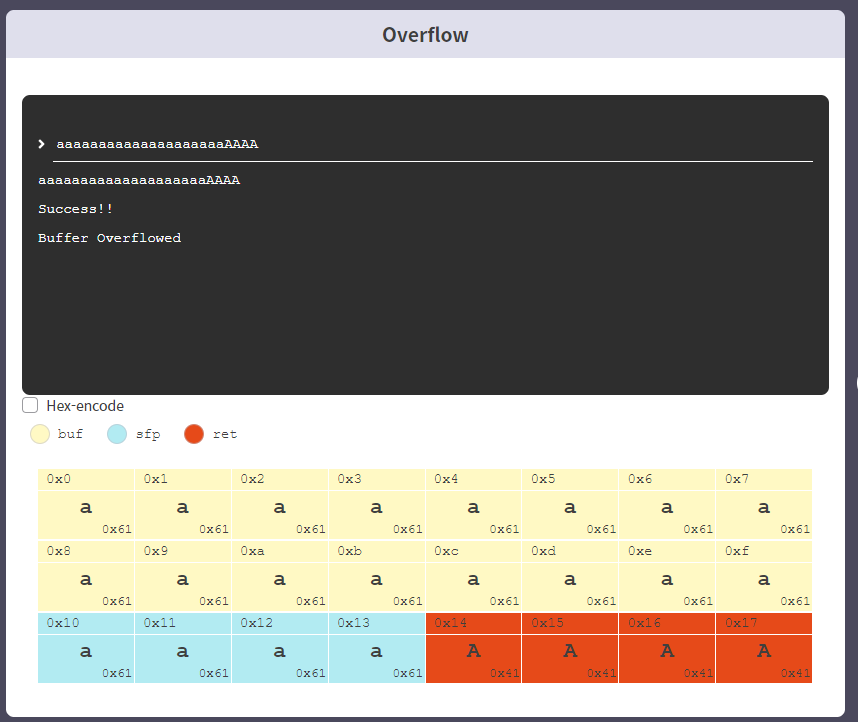
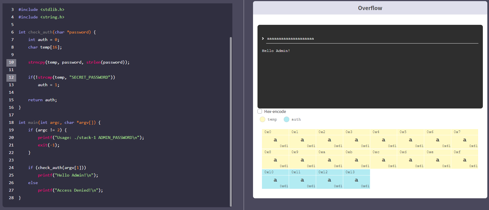
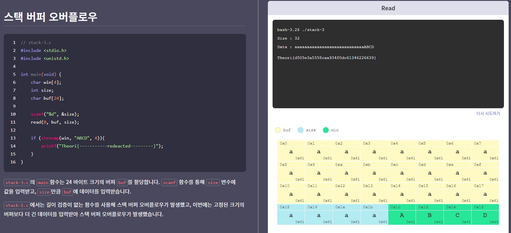
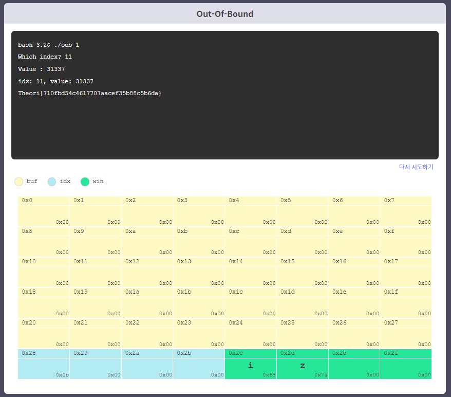
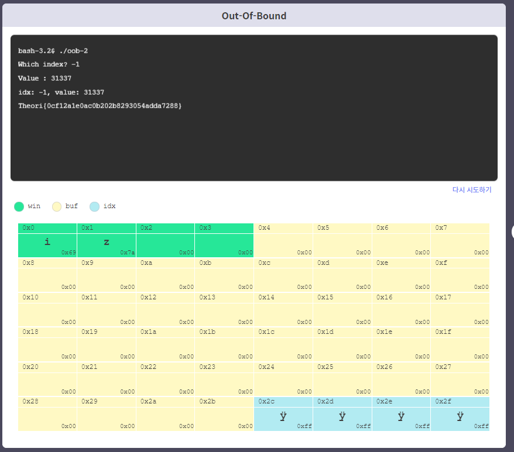
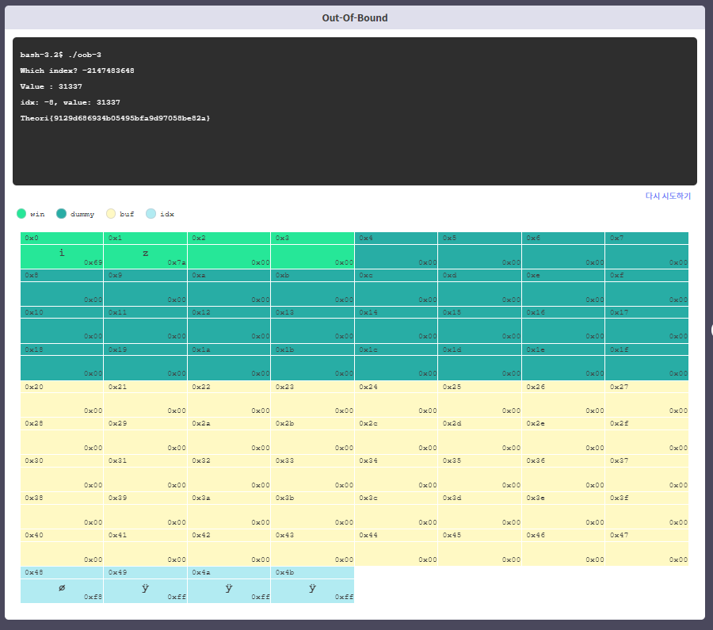

메모리 커럽션
===

# buffer overflow

> 버퍼가 허용할 수 있는 양보다 더 많은 데이터가 버퍼에 저장될때 나타나는 취약점
>
> > # dreamhack
> >
> > 많은 데이터를 넣어서 ret부분에 AAAA를 넣으면 된다.
>
> # 스택 버퍼 오브플로우
>
> 스택에 변수가 저장되는 것을 오버플로우를 이용해 다른 값으로 바꿀 수 있다.
>
> > # dreamhack
> >
> > 
> >
> > 스택에 의해 temp 다음 auth가 생성되었으므로 오버플로우를 이용해 auth값을 바꿔서 조건문이 통과될 수 있도록 한다.
>
> > # dreamhack
> >
> > 
> >
> > 앞과 같이 오버플로우를 이용한 것이다
>
> 이를 통해서 함수에서 길이제한이 없다면 잠재적으로 취약하다고 볼 수 있다.
>
 # heap overflow
> 스택과 비슷한 방식으로 동적으로 할당된 힙 메모리 영역에서 오버플로우를 이용해 값을 오염시키는 방식이다.

# out of boundary

> 버퍼에 정해진 길이범위를 벗어나는 인덱스에 접근할때 발생하는 취약점
>
> > # dreamhack
> >
> > 
> >
> > win에 접근하도록 인덱스를 설정하고 이를 이용해 값을 바꾼다.
>
> > # dreamhack
> >
> > 
> >
> > 나머지 연산에서 음수를 이용해 win에 접근한다.
>
> > # dreamhack
> >
> > 
> >
> > int 형의 표현가능 범위를 이용한다.

# off by one

>경계 검사에서 오차가 있을때 발생하는 문제

# format string bug

> 포멧 스트링을 사용하는 함수에서 발생하는 문제, 지정하지 않은 내용이 들어올때 나타남.
>
> %x %s 등 포멧스트링을 그대로 넣으면 이것을 문자열이 아닌 포멧스트링으로 작용하는 문제이다. 의도하지 않은 값이 파일에 저장된다.
>
> > # dream hack
> >
> > 

# Double Free, use after free

>double free는 이미 해제된 메모리를 다시 헤제하는 것
>
>use after free는 해제된 메모리에 접근해서 값을 쓰는것. 메모리가 해제되어도 포인터에 저장된 주소는 남아있기에 이를 이용해 접근할 수 있다.
>
>> 예)
>>
>> 

# 초기화되지 않은 메모리

> 변수를 초기화 하지 않을때 생성되는 취약점. 공격자가 초기화 되지 않은 메모리를 조작하고 이를 초기화되었다고 가정하고 사용하면 보안 취약점이 될 수 있다.

# 정수범위

> 정수의 형 변환을 제대로 고려하지 못할때 발생하는 것.
>
> 묵시적 형 변환: 연산시 자료형이 서로 다를경우 직접 명시하지 않으면, 자동으로 형 변환이 일어나는것. 취약점으로 이어질 수 있음.

 