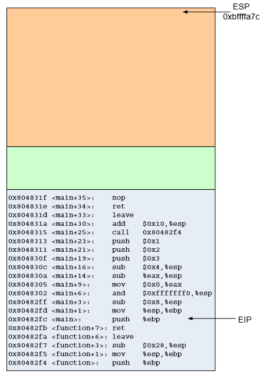
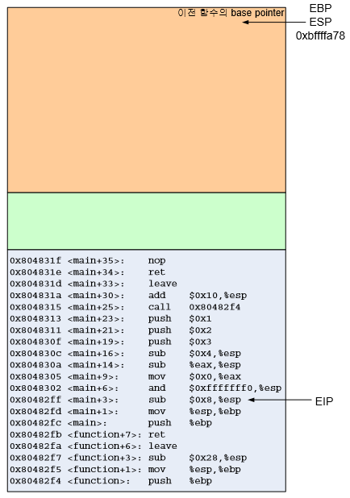
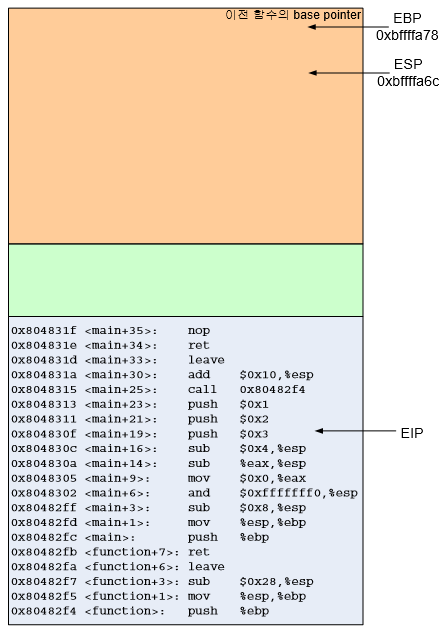
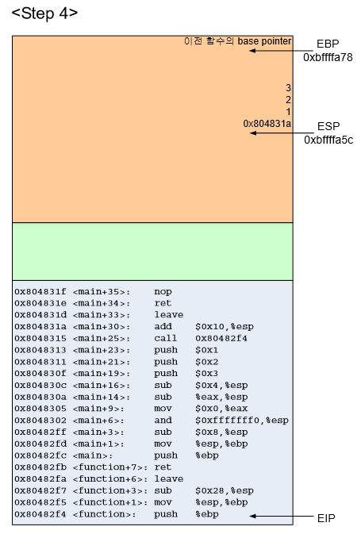
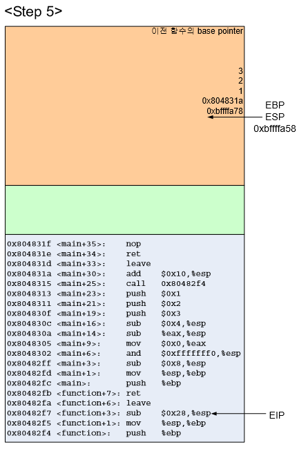
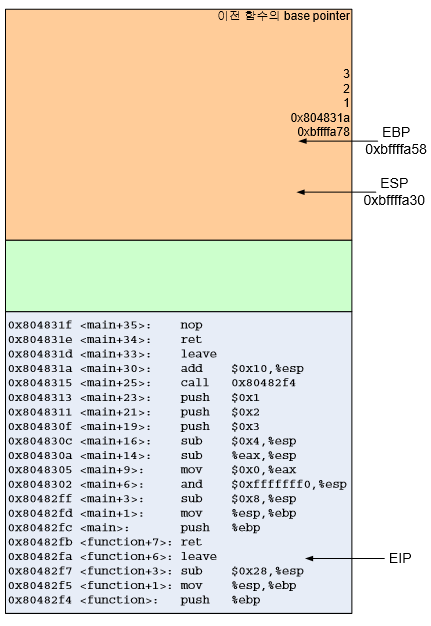
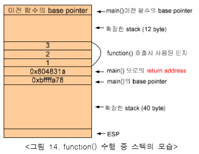
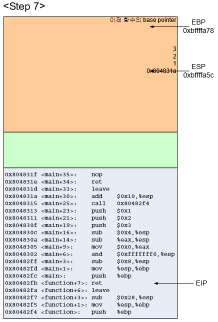
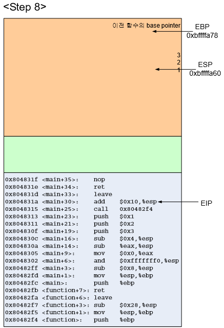

 버퍼 내 작동구조
 ===

# 8086 메모리 구조

> 시스템이 초기화 되기 시작하면 시스템은 메모리의 아랫부분에 커널을 적재한다. 이후 프로그램이 들어오면 segment라는 단위로 묶어서 메모리 영역에 저장시킨다. 
>
> > ## segment의 구조
> >
> > ### stack
> >
> > 프로그램이 사용하는 데이터 영역, 버퍼가 바로 여기에 있다. 다중스텍을 생성 할 수 있으며, 각 스텍간 교환도 가능하다. 또한 지역변수들이 여기에 들어있다. 스택이다보니 PUSH와 POP으로 이루어 진다.
> >
> > ### data
> >
> > 프로그램 실행시 사용되는 전역변수들이 들어있다. 변수 선언시 여기에 저장이 된다.
> >
> > ### code
> >
> > 프로그램의 명령어들이 들어있다. 

# 8086 CPU 레지스터 구조

> cpu에는 빠르게 읽고 쓰기위해  cpu 만의 레지스터가 있다.
>
> - 범용 레지스터:  연산에 사용되는 피연산자, 주소를 계산하는데 쓰이는 피연산자, 메모리 포인터가 저장되어있다.
>
>   > 프로그래머가 임의로 조작 할 수 있게 허용된 레지스터다 종류는 다음과 같다
>   >
>   > - EAX: 피연산자와 연산결과의 저장소
>   > - EBX: DS segment안의 데이터를 가리키는 포인터
>   > - ECX: 문자열 처리나 루프를 위한 카운터
>   > - EDX: I/O (input/output) 포인터
>   > - ESI: DS 레지스터가 가리키는 data segment 내의 어느 데이터를 가리키고 있는 포인터, 문자열 처리에서 source를 가리킴
>   > - EDI: ES 레지스터 가리키고 있는 data segment 내의 어느 데이터를 가리키고 있는 포인터, 문자열 처리에서 destination을 가리킴
>   > - ESP: SS레지스터가 가리키는 stack segment의 맨 꼭대기를 가리키는 포인터
>   > - EBP: SS레지스터가 가리키는 스텍상의 한 데이터를 가리키는 포인터
>
> - 세그먼트 레지스터:  데이터 세그먼트, 코드 세그먼트, 스택 세그먼트가 저장되어있다.
>
>   > 특정 세그먼트들을 가리키는 포인터 역활을 한다
>   >
>   > - CS 레지스터: 코드 세그먼트
>   > - DS, ES, FS, GS 레지스터: 데이터 세그먼트
>   > - SS 레지스터: 스택 세그먼트
>
> - 플래그 레지스터:  현재 상태나 조건등을 검사하는 플래그들이 있다.
>
>   > 상태 플래그, 컨트롤 플래그, 시스템 플래그들의 집합이다.
>
> - 인스트럭션 포인터: 다음에 수행해야 하는 명령들이 들어있다.
>
>   > 다음에 실행할 명령어가 있는 현재 code segment의 offset값을 가진다. EIP레지스터이다.

# 프로그램 작동시 segment안에서의 작용

> 프로그램을 실행시키면 segment 안에 스택 세그먼트, 데이터 세그먼트, 코드 세그먼트 순서로 들어있다. 
>
> 1.  
>
>    > 
>    >
>    > break point를 메인함수의 끝으로 두면 다음과 같이 ESP는 스택의 가장 윗부분을 나타내고 EIP는 메인함수를 나타낸다.(ESP가 스택 가장 윗 부분인 이유는 PUSH POP 해야 함으로) 또한 EBP도 있는데 이는 이전에 수행하던 함수의 데이터 보존하기 위해 있는 것이다.
>
> 2.  
>
>    > 
>    >
>    > 1. push %ebp
>    >
>    >    이전함수의 베이스 포인터를 저장하면서 stack pointer는 4byte 아래를 가리키게 된다.
>    >
>    > 2. mov %esp,%ebp
>    >
>    >    ESP에 EBP값을 복사해서 base pointer와 stack pointer가 같은 지점을 가리키게 된다.
>    >
>    > 3.  sub $0x8, %esp
>    >
>    >    ESP에서 8을 빼는 명령어이다. ESP는 8byte아래 지점을 가리키게 된다.(0xbffffa78->oxbffffa70)
>    >
>    > 4. and $0xfffffff0, %esp
>    >
>    >    ESP와 11111111 11111111 11111111 11110000 과 AND 연산을 한다. 그저 ESP 맨 뒤 4bit를 0으로 만들기 위한 것이다. 큰 의미는 없다.
>    >
>    > 5. mov $0x0, %eax
>    >
>    >    EAX 레지스터에 0 넣는다
>    >
>    > 6. sub %eax,  %esp
>    >
>    >    ESP에 있는 값에서 EAX 에 들어있는 값 만큼 뺀다. stack point를 EAX만큼 늘릴려고 하는 것 이지만 EAX에 0이 들어있어 일단은 의미없다.
>    >
>    > 7. sub $0x4, %esp
>    >
>    >    스택을 4바이트 확장한다. ESP안의 값은 0xbffffa6c가 된다.
>
> 3.  
>
>    > 
>    >
>    > 1. push $0x03 push $0x02 push 0x01
>    >
>    >    함수(1,2,3)을 실행하기 위해 넣는 값, 스택에 넣다보니 거꾸로 나와서 3, 2, 1순으로 나온다.
>    >
>    > 2. call 0x80482f4
>    >
>    >    0x80482f4에 있는 명령을 수행하라는 것이다. 저 위치는 function 이 위치하는 곳이다. call은 함수실행이 끝나고 되돌아올 위치를 스택에 넣고 EIP에 함수의 시작 지점의 주소를 넣는다. 돌아올 주소는 add $0x10,%esp가 있는 주소이다. 따라서 돌아올 위치는 스택에서 POP해서 알 수 있다. 이 주소가 버퍼오버플로우에서 중요한 **return address**이다.
>    >
>    >    이제 EIP에 0x80482f4가 들어간다.
>
> 4.  
>
>    > 
>    >
>    > 이제  main에서 쓰던 값들은 저장되고 function이 새롭게 시작된다.
>    >
>    > 1. push %ebp mov %esp,%ebp
>    >
>    >    지금까지 쓰던 base pointer를 저장하고 stack pointer를 base pointer로 삼는다.
>
> 5. 
>
>    > 
>    >
>    > 1. sub $0x28,%esp
>    >
>    >    esp를 이동시켜 40byte를 얻는다. function안의 지역변수들을 넣기위해 28바이트가 필요해서 할당한 것이다.(여백의 이유는 그냥 생각하지 말자... 이 할당하는 공간의 양도 gcc에 따라 다르다..)
>    >    
>    >
>    > function함수의 인자는 base pointer와 return address 사이에 존재하게 된다. main이 호출될때 주어지는 인자 argc, argv도 같은 배치를 가진다.
>    >
>
> 6. 
>
>    > 
>    >
>    > 스택은 다음과 같이 만들어 지며,  mov $0x41,[$esp-4] mov $0x42,[$esp-8] 등의 형식으로 ESP를 기준으로 데이터를 복사하고 넣는 방식으로 작동한다. 
>    >
>    > 
>    >
>    > 스택은 다음과 같은 형태를 가진다.
>
> 7. 
>
>    > 
>    >
>    > 1. leave
>    >
>    >    함수 프롤로그를 되돌리는 일이다. 위에서 함수 프롤로그로 했던 것과 반대로
>    >
>    >    mov %ebp, %esp
>    >
>    >    pop %ebp
>    >
>    >    를 수행한다. 이 두가지 일을 한번에 하며, main함수의 base pointer를 복구시킨다. POP했으므로, stack pointer는 1칸 위로 올라간다.
>    >
>    > 2. ret
>    >
>    >    이전함수로 이동하라는 것이며, eip는 직접 수정할 수 없지만 이 명령어를 통해 EIP로 POP되어서 저장된다.
>
> 8.  
>
>    > 
>    >
>    > 1. add $0x10, %esp
>    >
>    >    스택을 16byte줄인다. 0x804830c에 이쓴 명령어를 쓰기 전의 위치로 돌아간다. (4byte 확보하고 push 3번해서.)
>    >
>    > 2. leave ret
>    >
>    >    main함수 프롤로그 작업을 되돌리고 이전으로 돌아간다. 돌아가는 함수까지 알 필요는 없다.
